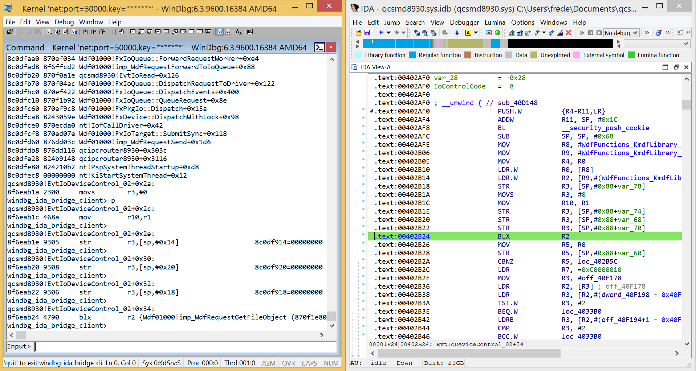

# WinDbgIda

WinDbg version of [gdbIda](https://github.com/Comsecuris/gdbida)  
Synchronize the code displayed in IDA with the code displayed in WinDbg.  

## Features

An IDA plugin (ida_windbg_bridge.py) acts as a TCP server and listen to the messages sent by a WinDbg extension (windbg_ida_bridge_client.py).  

 

The extension _windbg_ida_bridge_client.py_ intercepts all the commands from the user and sends the address of the current instruction to the IDA plugin. 

## Installation and usage

As the WinDbg extension is written in Python, we have to install the [pykd](https://github.com/ivellioscolin/pykd) extension first.  

Put the file _ida_windbg_bridge.py_ in the plugins folder of IDA. And start the plugin. When asked, input the IP address of the current machine and an available port.

On the machine where you will start WinDbg:  
Update the constants IDA_BRIGE_IP and IDA_BRIDGE_PORT in the file _windbg_ida_bridge_client.py_  
These constants must have the same values as those of the IDA plugin.    

Start WinDbg, set a breakpoint and continue execution until this break point is hit. This breakpoint must be in the modue currently disassembed by IDA.  

Run the _pykd_ extension:  
```!py```

Run the script _windbg_ida_bridge_client.py_:
```
import runpy
runpy.run_path("E:\\windbgIda\\windbg_ida_bridge_client.py")
```

Where `E:\windbgIda\` is the path of the script.  

Starting from now, the script sends the address of the current instruction to the IDA plugin.  
You can input all the WinDbg commands as usual (example `p` to execute the next instruction).  
When finished, type the command `quit` to exit the script and the command `quit()` to exit _pykd_.  


